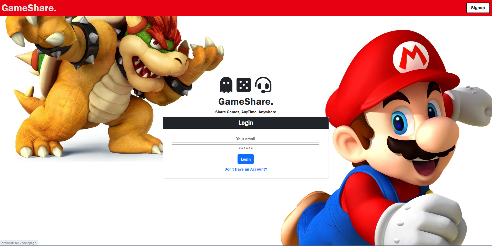
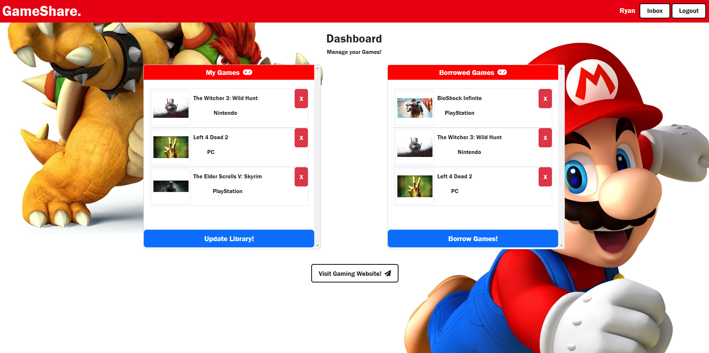

# GameShare

## Description
GameShare is a MERN application that allows users to borrow games between each other. Think of GameShare as your personal gaming library, but with the added bonus of sharing with other gamers! 
Did you ever see a new game you wanted to play, but didn't want to spend the money on.?With GameShare, you can easily browse and search for available games to borrow from other users, without breaking the bank.

Sharing is caring, and that's what GameShare is all about - bringing together gamers from all over to share their love for gaming. Whether you're on a tight budget, unsure if you'll like a game you want to buy, or just running out of things to play, GameShare has got you covered.

Sign up for GameShare today and join the fun of sharing gaming with other users!

-------------------

## Technologies Used

> MongoDB/ Mongoose

> Express

> React JS

> Node.js

> JWT

> GraphQL

> Bootstrap

## Usage/ Deployed Application: 

* GitHub repo: https://github.com/RyanMcd29/project-3

* Deployed Page: https://enigmatic-harbor-58701.herokuapp.com/

------

## Application Documentation

### Welcome to GameShare

### User's Dashboard

## Our Gaming Team

* [Mauxi Moncada](https://github.com/MoMoncada)

* [Ryan McDiarmid](https://github.com/RyanMcd29)

* [Will Cable](https://github.com/Cableman687)

------------

## License
[MIT License](https://opensource.org/license/mit/)